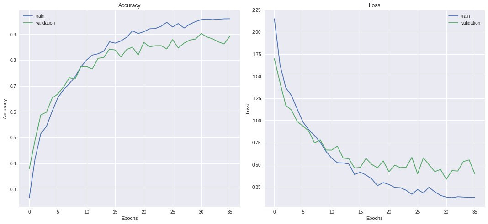
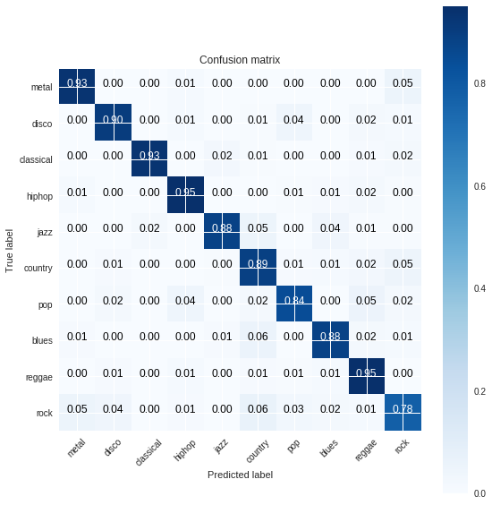

# Trained CNN for Genre classification
Trained CNN model for Genre classification on GTZAN dataset [CNN Model: https://github.com/Hguimaraes/gtzan.keras]

## Test trained CNN model
 In the `./weights/` you can find trained model weights and model architecture.

## Overview
For train CNN model of deep learning:

1. Read the audios as melspectrograms, spliting then into 3s windows with 50% overlaping resulting in a dataset with the size 19000x129x128x1 (samples x time x frequency x channels)**.
2. Shuffle the input and split into train and test (70%/30%)
3. Train the CNN and validate using the validation dataset

** In the case of the VGG, the channel need to have 3 channels

## Dependencies
 * [Keras](https://keras.io)
 * [Numpy](http://www.numpy.org)
 * [Librosa](https://librosa.github.io) - for audio feature extraction
 
 ## Accuracy

 * Training (at Epoch 35):
    
    * Training loss:    0.1283
    
    * Training accuracy:    0.9596

 * Testing:
    
    * Test loss:    0.3936
    
    * Test accuracy:    0.8921

## Accuracy, Loss and Confusion matrix

## License
[MIT Licence](./LICENSE)
